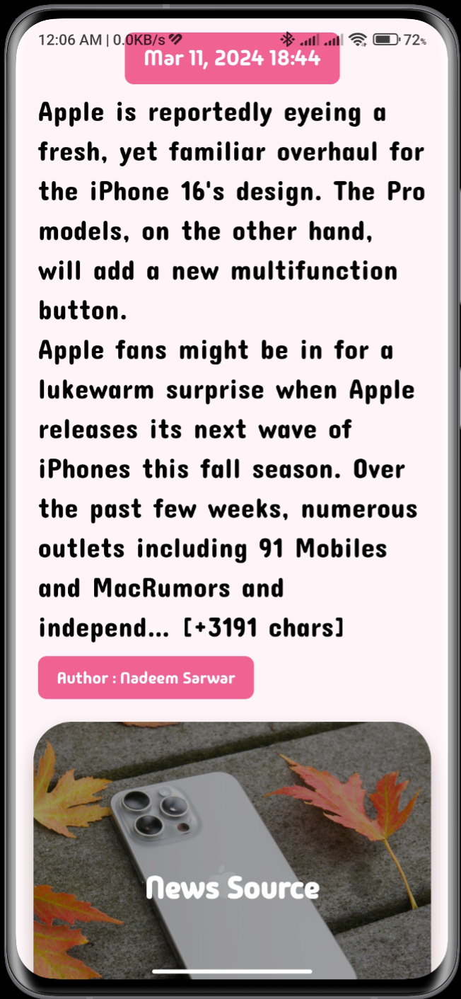
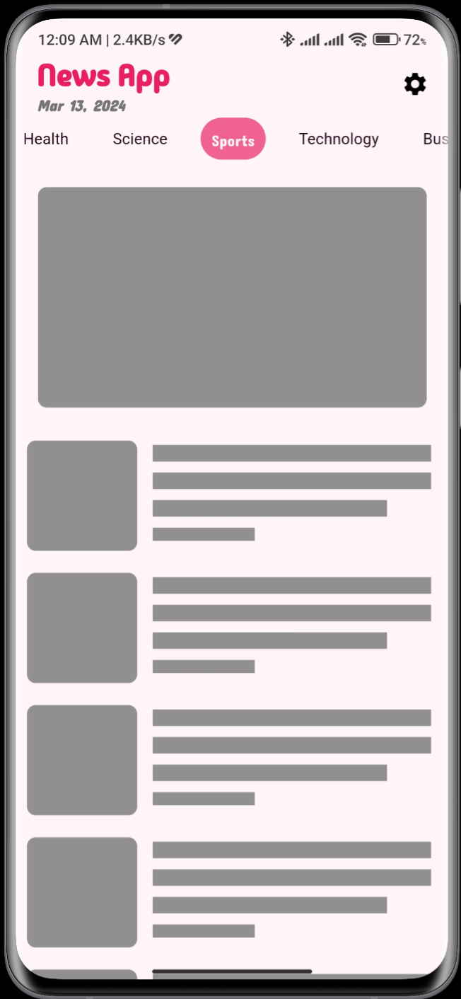

# news_app
News App developed with Flutter and API from News API
## Features
- Instant News
- News for all categories
- Ability to go to the main news source
- Support for Shimmer effect instead of ProgressIndicator
## Screenshots

### News App Interface

    

### News Details 

    

### Main news source launcher 
- go to the main source in the image widget

    

### Shimmer Effect 

    

## Technology
1. http 
This package contains a set of high-level functions and classes that make it easy to consume HTTP resources.
2. MVVM Architecture 
Model-View-ViewModel (MVVM) is a software design pattern that is structured to separate program logic and user interface controls.
3. Url Launcher 
Flutter plugin for launching a URL in the mobile platform.
4. card_swiper 
Swiper/Carousel for flutter, with multiple layouts, infinite loop.
